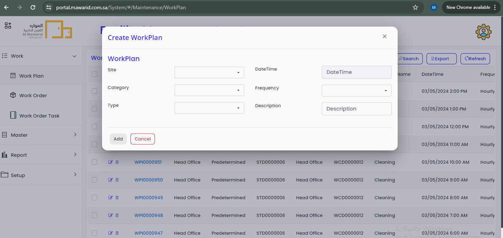
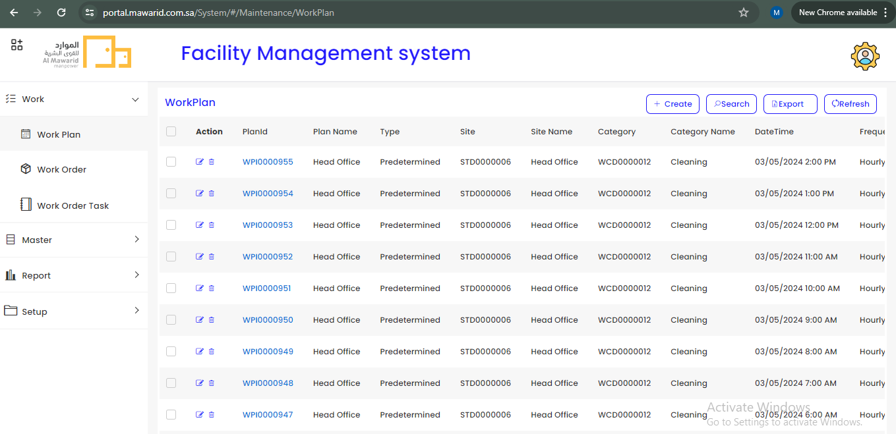
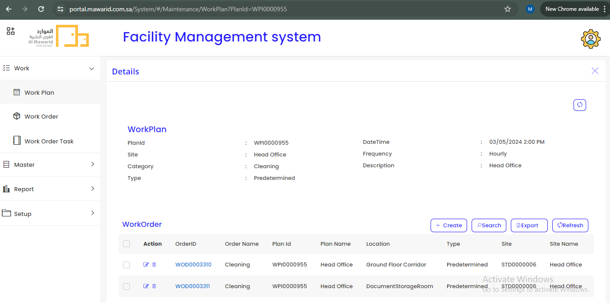
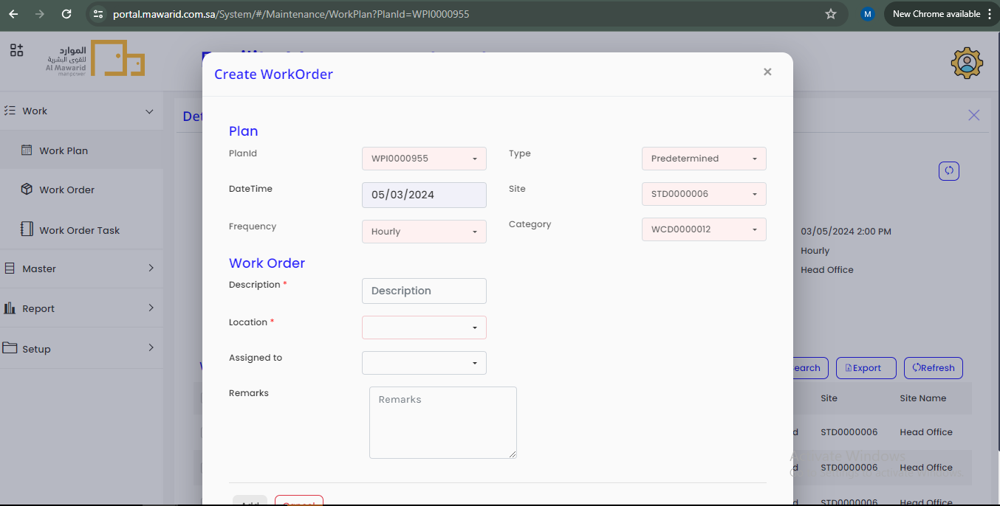
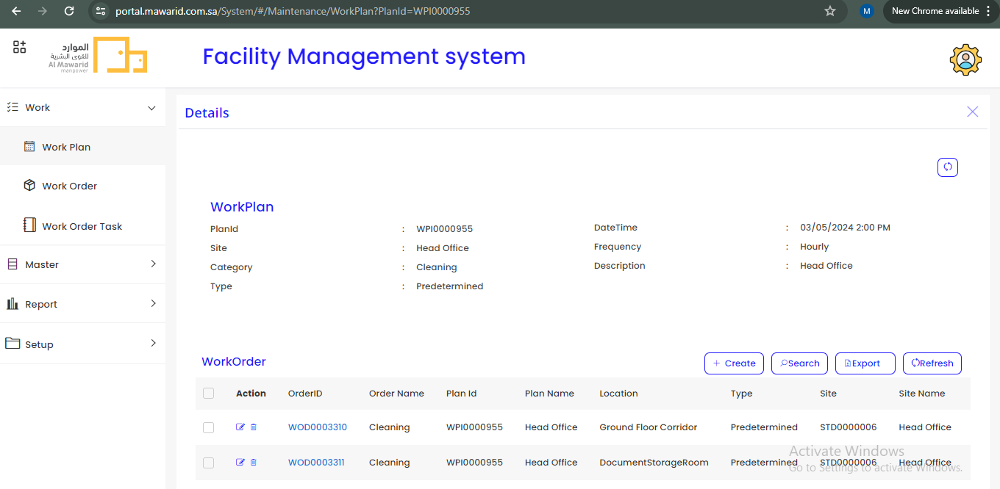
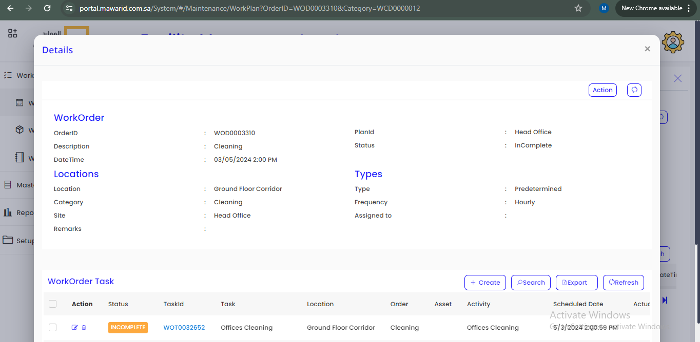
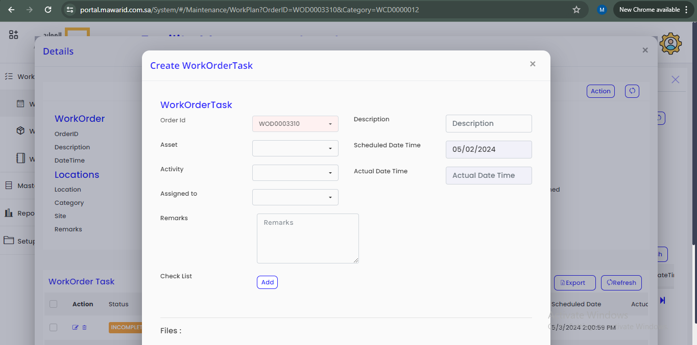
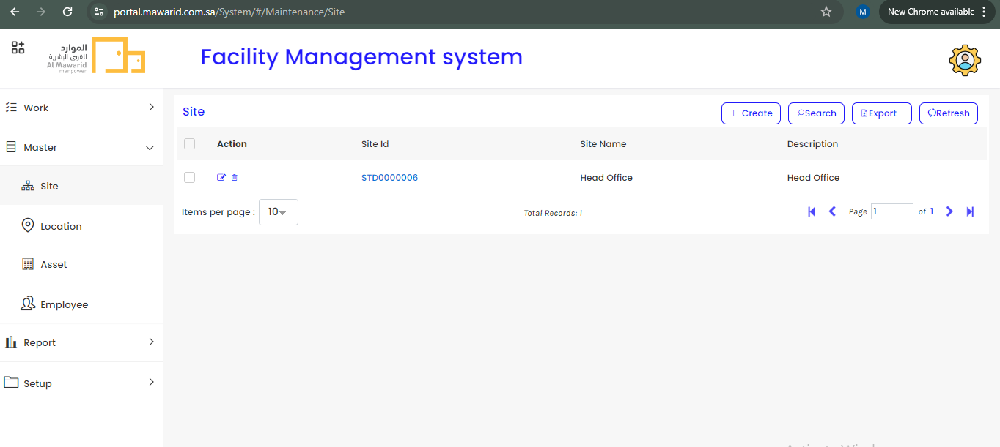

## Facility Management System - Admin Login Documentation

  This is the Mawarid Facility Management System's Admin Login Dashboard page. This Page contains mainly 4 menus which are Work, Master, Report and Setup and that 4 menus contains sub-menus. This Admin Login is created for the purpose, to Administrate and Supervise the work in the Facility Management System of the Company. Here we can see the process of work, work planning, scheduling, completing the task and reporting. These are the process which comes under the Admin's Responsibility.

  In the Work menu, there are 3 sub-menus. They are,

>  1. Work Plan
>  2. Work Order
>  3. Work Order Task

  ### Work Plan

  In this Work Plan page, Admin can create the Work Plan by filling the form. The form contains the Site, Category, Type, Date Time, Frequency and Description. By using these form fields, the admin can create the work plan for the work.

  Here, Site represents the location, Category represents the work category or tyepes of work, Type represents the work type which is preventive or corrective or breakdown, Date & Time represents that the particular work is when it wants be assigned to the workers, Frequency represents whenever the particular work is to be assign wheather hourly or daily or weekly or monthly or yearly becasue the work assigning to worker is automation not manually. Description textbox is to write description about this work plan.

  

  Once the Work Plan is created, the unique Plan Id will generate automatically for each and every work plan. 

  

  ### Work Order

  Here we can click the Plan Id to see the work plan details. In the Work Plan details page, we can create the Work Order here, because the Work Order is comes under the Work Plan. Usually Work Order Task is comes under the Work Order and the Work Order is comes under the Work Plan.

  

  Admin can create the Work Order under Work Plan through the Work Plan details page. In the Work Order Create form, some of the fields were patch automatically because the Work Order is creating through the particular Work Plan details page.

  

  In this Work Order Create form contains Decsription, Location, Assigned to and Remarks. Here we can write any description about this work order in Description box, Location represents the Exact location of the work, Assigned to represents Employee, assigning work order to the particular employee. In the Remarks, an admin can add any remarks regarding the work order.

  After created the Work Order through the Work Plan details page. The unique Work Order will generate for each and every work order create.

  

  ### Work Order Task

  By Clicking the Order Id, the Work Order details page will open. In that Work Order details page, here we can create the Work Order Task. Because the Work Order Task is comes under the Work Order. 

  

  In the Work Order Task Create form, here also some feilds wants to be fill. The form contains fields are Asset, Activity, Assigned to, Description, Scheduled Date Time, Actual Date Time, Remarks and the Checklist.

  Here, the Assets represents the assets if any available, Activity represents the activity of the work, Assigned to represents the employee, who will fit for that work, Description textbox represents any description regarding the task, Scheduled Date Time represents the scheduling the task date, Actual Date Time represents the Actual date wants to be fill when the work order task is creating. Admin can update any remarks about the task in Remarks textbox. Admin can add checklist if it is needed for any particular task. This is like to remind the worker to check the functionality of the particular thing.

  

  ### Master

  The Master menu has an important functionality to add any New Site, Location, Asset and Employee.

  

