## Facility Management System - Admin Login Documentation

> *  This is the Mawarid Facility Management System's Admin Login Dashboard page. This Page contains mainly 4 menus which are Work, Master, Report and Setup and that 4 menus contains sub-menus. This Admin Login is created for the purpose, to Administrate and Supervise the work in the Facility Management System of the Company. Here we can see the process of work, work planning, scheduling, completing the task and reporting. These are the process which comes under the Admin's Responsibility.

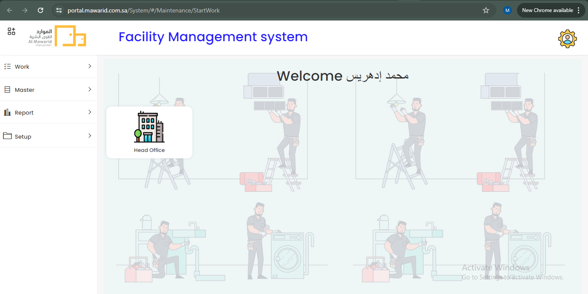

  In the Work menu, there are 3 sub-menus. They are,

>  1. Work Plan
>  2. Work Order
>  3. Work Order Task

  ### `Work Plan`

> *  In this Work Plan page, Admin can create the Work Plan by filling the form. The form contains the `Site, Category, Type, Date Time, Frequency and Description`. By using these form fields, the admin can create the work plan for the work.

> *  Here, Site represents the location, Category represents the work category or tyepes of work, Type represents the work type which is preventive or corrective or breakdown, Date & Time represents that the particular work is when it wants be assigned to the workers, Frequency represents whenever the particular work is to be assign wheather `hourly or daily or weekly or monthly or yearly` becasue the work assigning to worker is automation not manually. Description textbox is to write description about this work plan.

  

> *  Once the Work Plan is created, the unique Plan Id will generate automatically for each and every work plan. 

  

  ### `Work Order`

> *  Here we can click the Plan Id to see the work plan details. In the Work Plan details page, we can create the Work Order here, because the Work Order is comes under the Work Plan. Usually Work Order Task is comes under the Work Order and the Work Order is comes under the Work Plan.

  

> *  Admin can create the Work Order under Work Plan through the Work Plan details page. In the Work Order Create form, some of the fields were patch automatically because the `Work Order` is creating through the particular `Work Plan details page`.

  

> *  In this Work Order Create form contains `Decsription, Location, Assigned to and Remarks`. Here we can write any description about this work order in Description box, Location represents the `Exact location of the work, Assigned to represents Employee, assigning work order` to the particular employee. In the Remarks, an admin can add any remarks regarding the work order.

> *  After created the Work Order through the Work Plan details page. The unique Work Order will generate for each and every work order create.

  

  ### `Work Order Task`

> *  By Clicking the Order Id, the Work Order details page will open. In that Work Order details page, here we can create the Work Order Task. Because the Work Order Task is comes under the Work Order. 

  

> *  In the Work Order Task Create form, here also some feilds wants to be fill. The form contains fields are `Asset, Activity, Assigned to, Description, Scheduled Date Time, Actual Date Time, Remarks and the Checklist`.

> *  Here, the Assets represents the assets if any available, `Activity` represents the activity of the work, `Assigned to` represents the employee, who will fit for that work, `Description` textbox represents any description regarding the task, `Scheduled Date Time` represents the scheduling the task date, `Actual Date Time` represents the Actual date wants to be fill when the work order task is creating. 

> *  Admin can update any remarks about the task in Remarks textbox. Admin can add checklist if it is needed for any particular task. This is like to remind the worker to check the functionality of the particular thing.

  

  ### `Master`

> *  The Master menu has an important functionality to add any New Site, Location, Asset and Employee.

  

  ### `Site`

> *  In a facility management system, A "Site" refers to a specific location or property that requires management and oversight. It serves as a foundational unit within the system, allowing facility managers to efficiently organize and control various aspects of facility operations.

> *  This includes tracking physical assets, managing space utilization, scheduling maintenance tasks, ensuring compliance with regulations, monitoring security measures, and handling financial aspects related to the site. 

> *  Essentially, a site in a facility management system serves as a central point for managing all the essential functions and activities associated with a particular facility or property.

> *  Here, In our application we can create or add a site for the facility operations by clicking the create button. The Site create form will open, Fill the form with Site Name, Site Image and Description. The Site will create successfully with the unique site id for each and every site. The Action button also available for Edit and Delete the site.

  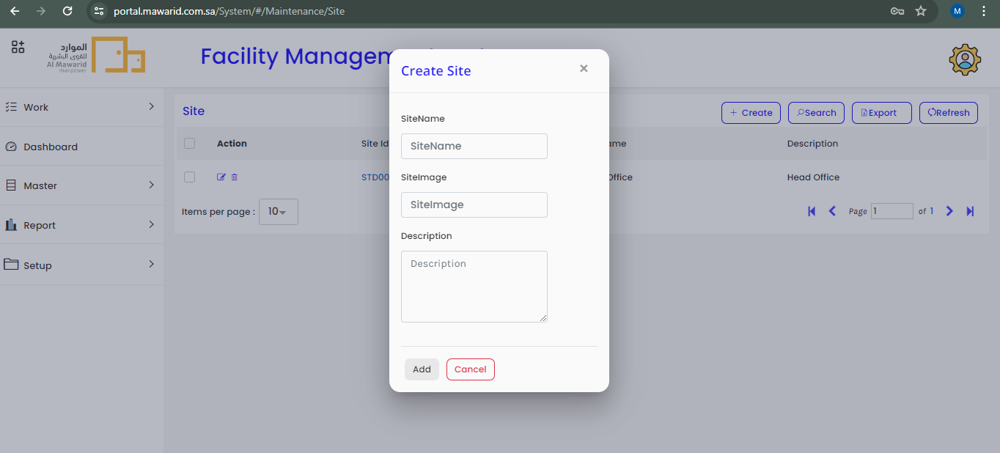

> *  To view the Site details, click the unique Site id to see the details page. At the bottom of the details page, there is an option available to create an Employee Site and the created employee site list also available in this page. 

  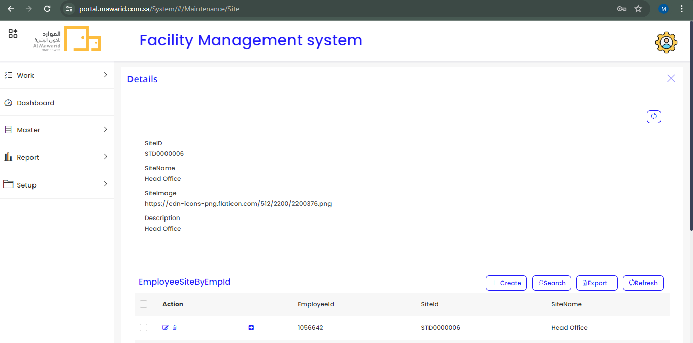

> *  Basically Employee Site is creating for dividing and  assigning the site for an employee for a particular work has to be done within a particular area. 

> *  To Create Employee Site by clicking the create button and create popup will open, An Admin can fill form by choosing Site Name and Site Id and the unique Employee Id will generate automatically while creating Employee Site. 

> *  There is also an Action available to Edit and Delete the Employee Site if any mistakes done. The Left side of the Employee Id, "+" icon is available. By using this icon to assign the employee to the particular site for the particular work.

  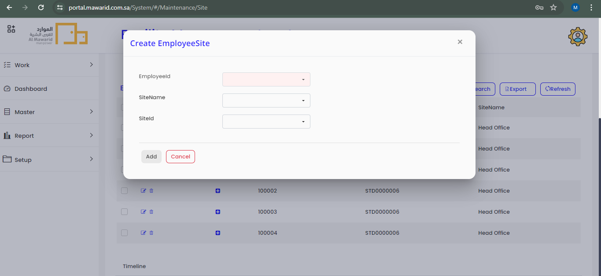

  ### `Location`

> *  In a facility management system, "location" refers to the specific physical placement or position of assets within a facility. It involves accurately identifying and documenting where each asset is located within the facility, whether it's a room, floor, building, or outdoor area. Managing asset locations helps facilitate efficient operations by enabling staff to easily locate and access assets when needed. 

> *  Additionally, location data can aid in space planning, maintenance scheduling, and emergency response efforts. By effectively managing asset locations, facility managers can streamline workflows, optimize space utilization, and enhance overall productivity within the facility.  

  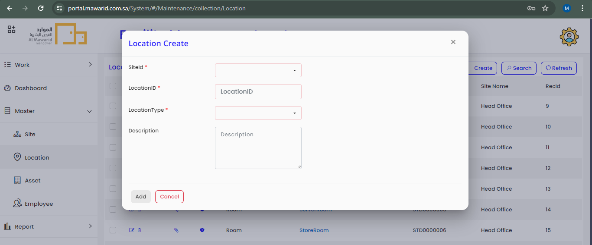

> *  This page is the location list page and we can create the Location here. Click the Create button, Click the Location in the Work Item Type Lis. There is 4 fields in the Location Create form, Site Id, Location Id, Location Type and Description. Except Description other 3 fields are mandatory fields and the Location Id is need not to be fill manually, it will generate automatically.

  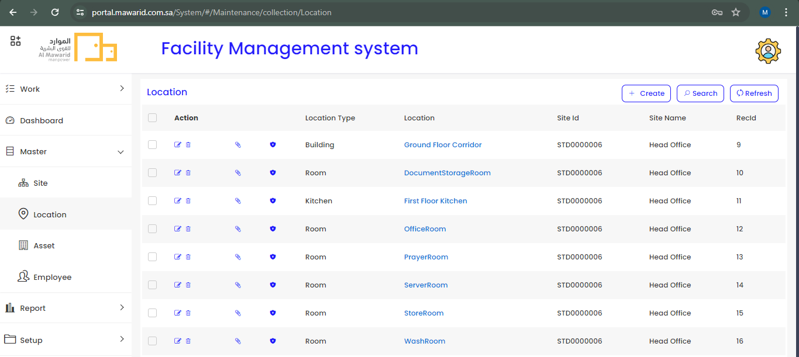

> *  Here, It lists the total list of locations which comes under the facility operations. In this list we can Edit or Delete the location incase of mistakes happend while creating. Also the options available to give permission for the user to access the Create, Update, Delete or ReadOnly in the user location.

  ### `Asset`

> *  In facility management systems, an asset typically refers to any physical item or resource within a facility that contributes to its operations or services. This can include equipment, machinery, furniture, vehicles, and buildings. Assets are managed within the system to ensure they are properly maintained, tracked for location and condition, and utilized efficiently to support the facility's functions. Effective asset management helps optimize resource allocation, minimize downtime, and ensure regulatory compliance, ultimately enhancing the overall performance and value of the facility. 

  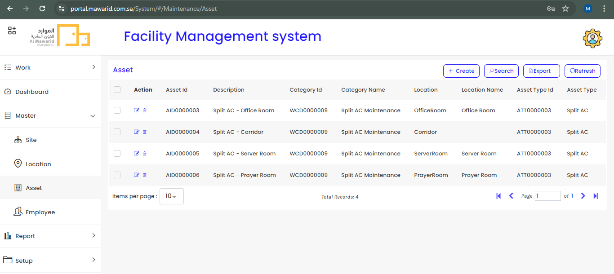

> *  This is the list of Assets with Edit and Delete options. To Add a New Asset in the list, Click the Create button in top of the list. The Asset Create popup will open and it has a 5 fields in the create form. They are, Asset Id, Asset Type, Category Id, Location and Description. Asset Id will generate automatically for each and every new asset create. Except the Asset Id, the Asset Type, Category Id and Location will select data from dropdown and Description is a Textbox as you can write any description about the asset.

  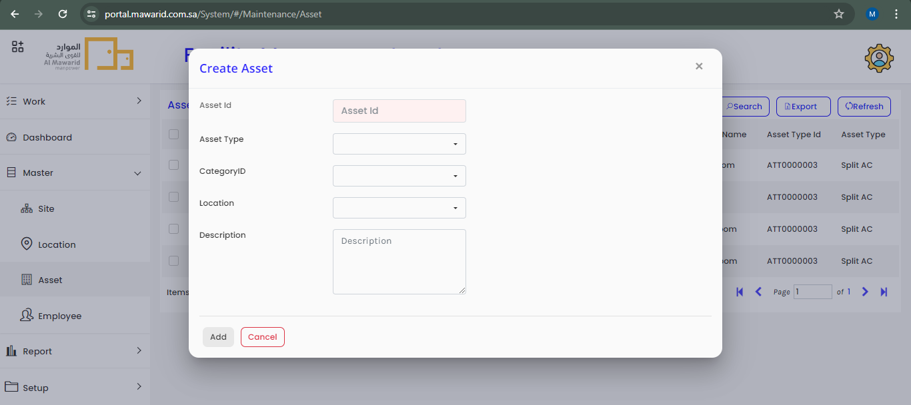

  ### `Employee` 

> *  In a facility management system, an "employee" refers to an individual who is part of the workforce responsible for managing, maintaining or operating the facility. This can include maintenance technicians, custodial staff, security personnel, administrative staff, and managers overseeing various aspects of facility operations. 

> *  Employee data within the facility management system typically includes information such as contact details, job roles, certifications, training records, work schedules, and performance evaluations. Managing employee information in the system allows facility managers to efficiently allocate resources, track staff availability, ensure compliance with regulations, and monitor workforce productivity. 

> *  By effectively managing employee data, facility managers can optimize staffing levels, improve communication among team members, and enhance overall operational efficiency within the facility.

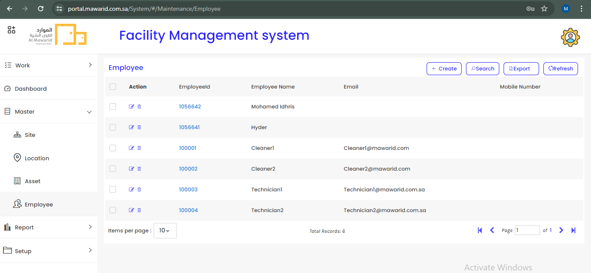

> *  In this Employee menu there is a list of total employees who are working in the Facility Operations. In this list table we can `Edit` the `Employee Name and Email` and we can `Delete` the whole `Employee data`. 

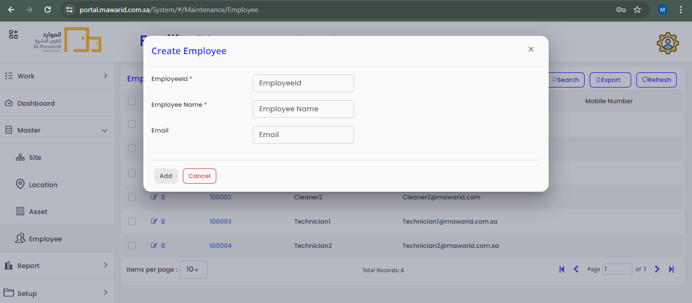

> *  We can add a New Employee by clicking the Create button, the create employee popup will open and there are 3 fields `Employee Id, Employee Name and Email`. 

> *  `Employee Id and Employee Name` are mandatory fields, but the unique employee id will generate automatically while creating the new employee.  

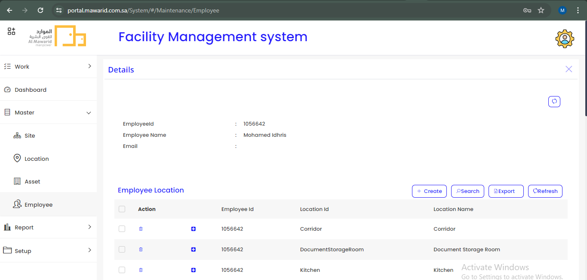

> *  Click the Employee Id to view the Employee's details page. At the bottom of the details page, here we can create a `Employee Location, Employee Asset, Employee Site and Employee Category` for that particular employee by clicking the Create button.

  ### Create Employee Location

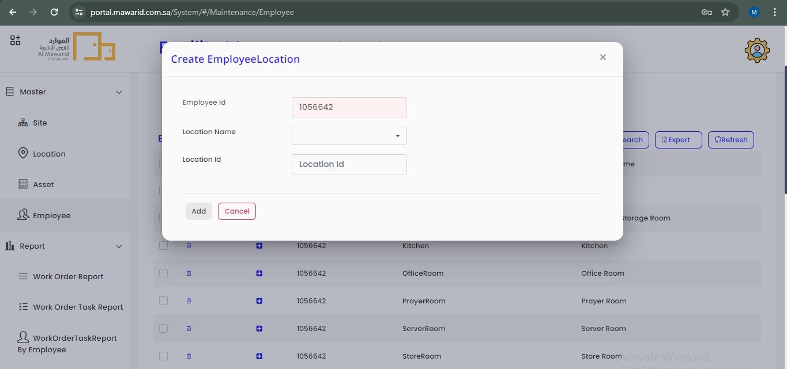

> *  The popup will open for the Employee Location Create with 3 fields named as `Employee Id, Location Name, Location Id`. While creating employee location, the unique Employee Id will patch automatically for that particular employee. 

> *  An Admin would choose the `Location Name` in the `dropdown` and the `Location Id` will patch automatically based on the Location Name.

> *  Here the `Action` available only for `Delete` the Employee Location.

> *  Click the `'+'` icon near the Employee Id to `assign` the `Employee` to the particular `Location`.

  ### Create Employee Asset

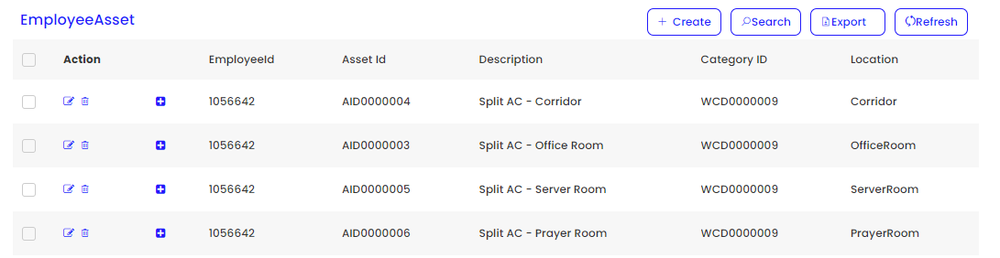

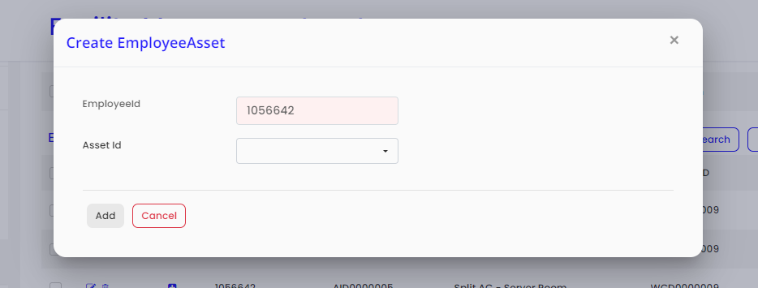
 
> *  Here the list of Employee Asset table is available.

> *  Click the Create button to create Employee Asset. By clicking the create button, the popup will open with 2 fields as `Employee Id` which will patch automatically and the Admin can choose `Asset Id` from the dropdown to create the Employee Asset for the particular employee.

> *  `Edit and Delete` Actions available in the Employee Asset list table.

> *  Click `'+'` icon near the Eployee Id to `assign` the `Employee` to the particular `Asset`.

  ### Create Employee Site

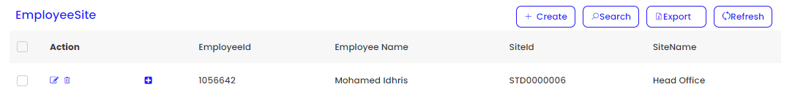

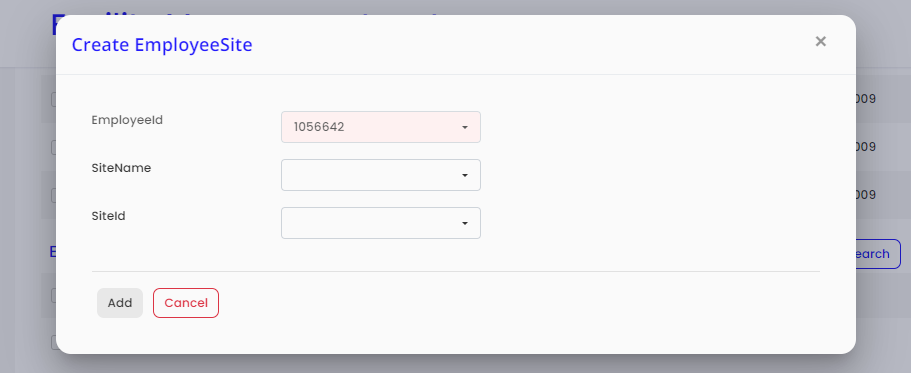

> *  Click the `Create button` to open the `Employee Site Create` popup.

> *  There are `3 fields` in the create popup, `Employee Id, Site Name and SiteId`.

> *  Employee Id will patch automatically in the form and select the `Site name` in dropdown and the `Site Id` will patch automatically based on `Site Name`.

> *  `Edit and Delete` Actions available in the Employee Site list table.

> *  Click `'+'` icon near the Eployee Id to `assign` the `Employee` to the particular `Site`.

  ### Create Employee Category

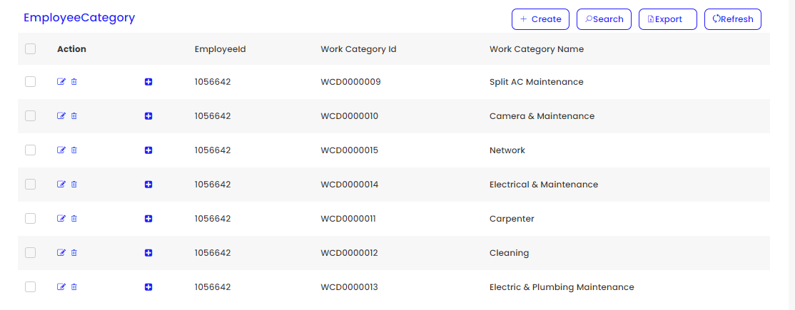  

> *  Here the list of Employee Category table is available.

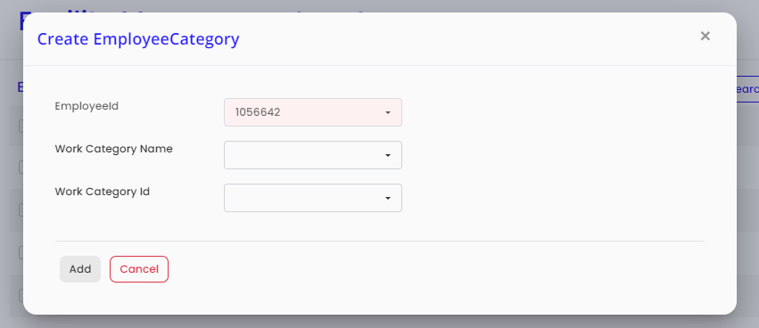

> *  To Create Employee Category, Click the create button to create `Work category` for a particular `Employee`.

> *  There are `3 fields` in the Emploeyee Category Create form. They are, `Employee Id, Work Category Name and Work Category Id`.

> *  Employee Id will patch automatically in the form.

> *  Select the Work Category Name from the `dropdown` and the `Work Category Id` will patch automatically based on the `Work Category Name`.

> *  `Edit and Delete` Actions available in the Employee Category list table.

> *  Click `'+'` icon near the Eployee Id to `assign` the `Employee` to the particular `Work Category`.

  ### `Report`

  In the Report menu there are 3 sub-menus, They are;

>  1. Work Order Report
>  2. Work Order Task Report
>  3. Work Order Task Report By Employee

  ### `Work Order Report`

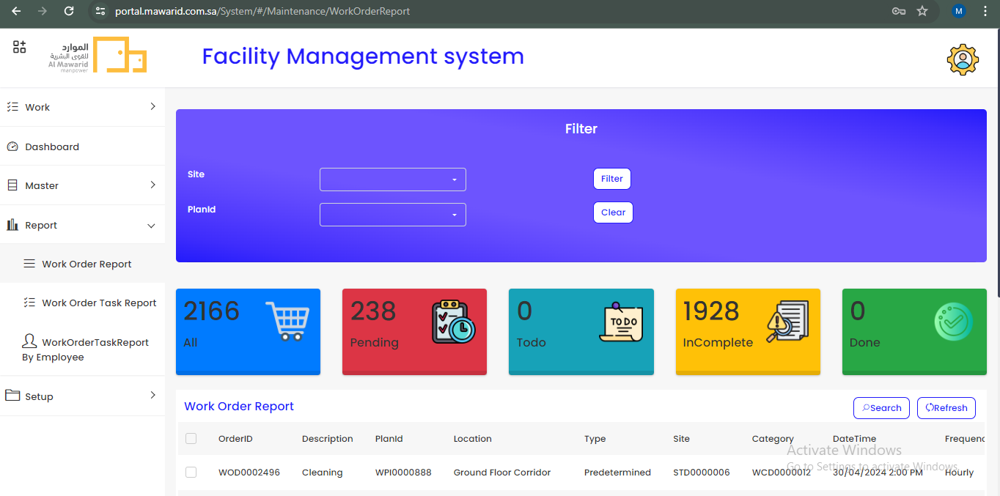  

 

